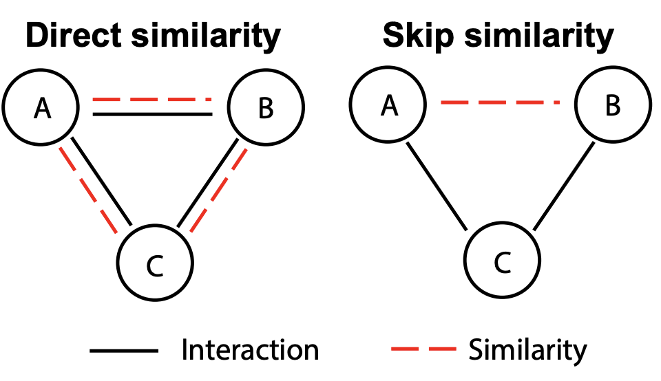

<h2 align="center">
<p> SkipGNN: Predicting Molecular Interactions with Skip-Graph Networks</h2>

Molecular interaction networks are powerful resources for the discovery. While deep learning on graphs has dramatically advanced the prediction prowess, current graph neural network (GNN) methods are optimized for prediction on the basis of direct similarity between interacting nodes. In biological networks, however, similarity between nodes that do not directly interact has proved incredibly useful in the last decade across a variety of interaction networks.

Here, we present SkipGNN, it predicts molecular interactions by not only aggregating information from direct interactions but also from second-order interactions, which we call skip similarity. In contrast to existing GNNs, SkipGNN receives neural messages from two-hop neighbors as well as immediate neighbors in the interaction network and non-linearly transforms the messages to obtain useful information for prediction. 


<p align="center"></p>

*(Left)* Traditionally, an interaction between nodes A and B implies that A and B are similar and vice versa. *(Right)* In contrast, in molecular interaction networks, directly interacting entities are not necessarily similar, which has been observed in numerous networks, including genetic interaction networks and protein-protein interaction networks.


## Install

```bash
git clone https://github.com/kexinhuang12345/SkipGNN.git
cd SkipGNN
python setup.py install
```

## Example

```
python train.py \
    --epochs 15 \
    --lr 5e-4 \
    --batch_size 256 \
    --hidden1 64 \
    --hidden2 16 \
    --hidden_decode1 512 \
    --network_type DTI \
    --data_path '../data/DTI/fold1' \
    --input_type one_hot
```

You can change the ```network_type``` to DTI, DDI, PPI, GDI. Please change the data_path accordingly.

In the paper, we use node2vec to initialize the node attributes. But empirically, we find simple one-hot position encoding is also good for SkipGNN. If you want to reproduce the result, you could put the node2vec embedding generated from [this repo](https://github.com/aditya-grover/node2vec) under ```data/DTI/fold1/dti.emb```  and set ```--input_type node2vec```.

A Jupyter notebook example is provided in [DEMO](Example_Train.ipynb).


## Dataset

We provide the dataset in the [data](data/) folder. 

| Data  | Source | Description | Processing Code |
|-------|----------|----------|----------|
| [DTI](data/DTI/) | [BIOSNAP](http://snap.stanford.edu/biodata/datasets/10002/10002-ChG-Miner.html)| A drug-target interaction network betweeen 5,018 drugs that target 2,325 proteins with 15,139 interactions. The drugs are from the US market.| [data_process_DTI.ipynb](data/data_processing_DTI.ipynb)| 
| [DDI](data/DDI/) | [BIOSNAP](http://snap.stanford.edu/biodata/datasets/10001/10001-ChCh-Miner.html)| A drug-drug interaction network betweeen 1,514 drugs with 48,514 interactions, which are approved by the FDA.| [data_process_DDI.ipynb](data/data_processing_DDI.ipynb)| 
| [PPI](data/PPI/) | [HuRI](http://www.interactome-atlas.org)| A protein-protein interaction network from the Human Reference Protein Interactome Mapping Project. We use the HuRI-III version from the [L3 paper](https://zenodo.org/record/2008592#.XrYUlpNKjOR). It consists of 5,604 proteins with 23,322 interactions. | [data_process_PPI.ipynb](data/data_processing_PPI.ipynb)| 
| [GDI](data/GDI/) | [DisGeNET](https://www.disgenet.org)| A disease-gene association network betweeen 9,413 genes and 10,370 diseases with 81,746 associations, which are curated from GWAS studies.| [data_process_GDI.ipynb](data/data_processing_GDI.ipynb)| 


## Skip-Graph Construction
To integrate the power of skip-graph in your own GNN codes, you could simply apply a new GNN on the skip graph, which is generated using two lines. ```adj``` is a scipy.sparse adjacency matrix for the original graph.

```python 
adj_skip = adj.dot(adj)
adj_skip = adj_skip.sign()
```

See [here](SkipGNN/utils.py) for more details.


## Cite Us

Cite [arxiv](https://arxiv.org/abs/2004.14949) for now:

```
@article{huang2020skipgnn,
  title={SkipGNN: Predicting Molecular Interactions with Skip-Graph Networks},
  author={Huang, Kexin and Xiao, Cao and Glass, Lucas and Zitnik, Marinka and Sun, Jimeng},
  journal={arXiv preprint arXiv:2004.14949},
  year={2020}
}
```

The code framework is based on [pygcn](https://github.com/tkipf/pygcn).

## Contact

Please send questions to kexinhuang@hsph.harvard.edu or open an issue.
